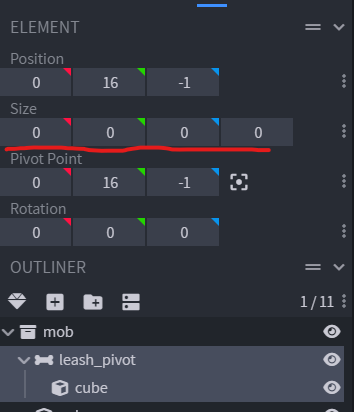
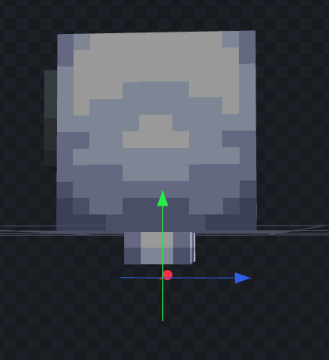
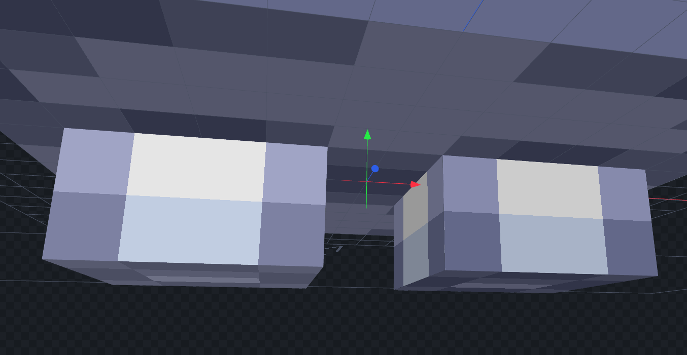
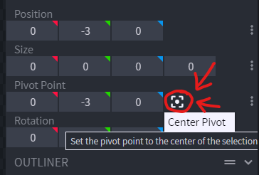
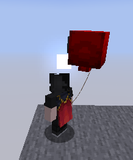

# Leash location

### Step 1

Create a new bone and call it `leash_pivot`.\
Set the `size` of the cube to `0, 0, 0`.

<figure><figcaption></figcaption></figure>

### Step 2

Move it to where you want the leash to be attached.

<figure><figcaption></figcaption></figure>

Zoom and make the final adjustment to precisely place it where you want.

<figure><figcaption></figcaption></figure>

### Step 3

Press Center Pivot button to center the pivot.

<figure><figcaption></figcaption></figure>

### Done

<figure><figcaption></figcaption></figure>
