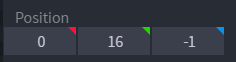
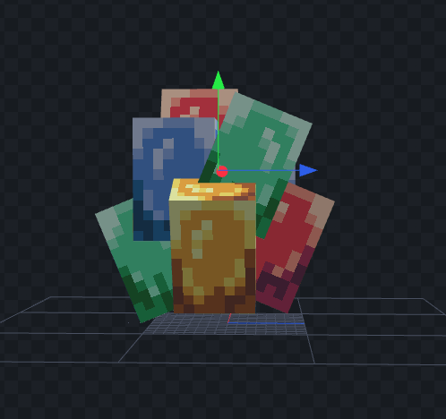

# Leash location

## Leash location

You can decide the leash location.

### Step 1

Create a leash bone called `leash_pivot`.

<figure><figcaption></figcaption></figure>

### Step 2

Move it a little upper on when the leash will be attached, approximately `14` units upper.\
So for example if you want the leash to be attached at height (Y) `2` you have to move it to height `16`.

<figure><figcaption></figcaption></figure>

<figure><figcaption></figcaption></figure>
