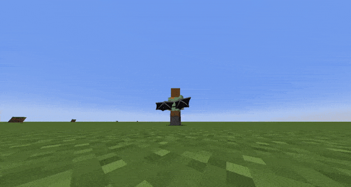

# Advanced Body Item


### Advanced body item require ItemsAdder to work.


## Creating the entity

### Step 1

Create an ItemsAdder entity reading the tutorial:



### Step 2

Create the cosmetic configuration

```yaml
  wings_enderdragon:
    display_name: "Enderdragon Wings"
    type: BODY_ENTITY
    model:
      gui: dragon_head
      normal: cosmetics:wings_enderdragon
    dye:
      enabled: false
```

As you can see I set the `normal` model to the name of the **custom entity** created with ItemsAdder.

### Step 3

You're done

<figure><figcaption></figcaption></figure>

## Final notes


You can even create animated cosmetics, just animate the idle animation of the entity using Blockbench.


## Known issues


### Delayed cosmetic while moving

This is a known issue and cannot be fixed, but note that this behavior is only visible by the current player.\


All other players will see the cosmetic attached to the player with less delay.\
This also depends on the player ping and on the server performance.











