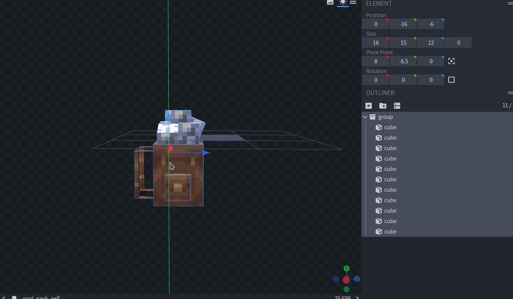

# Normal and self models

## Introduction

It's important to have two separated models because the self model will avoid getting the player view occupied by the cosmetic and potentially cause annoyances during the gameplay (placing blocks, attacking, walking).














If you are not interested into setting a `self` and `normal` model you can skip this tutorial and only use the `normal` attribute\
Do not set the `self` attribute at all if you don't want to use a different item for the self view.


### Normal model

A normal model is the model which is shown to every player but the local player (yourself).

### Self model

A self model is the model which is shown ONLY to the local player (yourself).

## Implementing the fix

### Step 1

You have to make a copy of your `.json` model file, rename it `_self.json`.\
For example: `squirrel_tail.json` -> `squirrel_tail_self.json`

### Step 2

Decide a new **CustomModelData** for that item and add it to the item file or use ItemAdder to automate the process (depends on your needs, refer to [ItemsAdder wiki ](https://itemsadder.devs.beer/)to learn how to create items).

In this example I use `400008` for the **normal** model and `400009` for the **self** model.

`assets/minecraft/models/item/XXX.json`

```json
{
  "predicate": { "custom_model_data": 400008 },
  "model": "cosmetics:body/squirrel_tail"
},
{
  "predicate": { "custom_model_data": 400009 },
  "model": "cosmetics:body/squirrel_tail_self"
},
```

### Step 3

Edit your cosmetics configuration and add the **self** model.

```yaml
  squirrel_tail:
    display_name: "Squirrel Tail"
    type: BODY_ITEM
    model:
      gui: potion:400008
      normal: potion:400008
      self: potion:400009   ### <------ HERE
    dye:
      enabled: false
```

### Step 4

This is the most important step, you have to edit the **self** model.\
You have to move the model down like that, then view it ingame until you're satisfied with the result.

This requires you to check ingame a few times until the model is correctly positioned, it requires some tries to achieve the perfect location, but you can easily use some of the example models  in order to avoid losing time.vi



## Differences

### Normal model

 (1).png>)

### Self model

.png>)

## Issues with big models

&#x20;Read here if you cannot move the model down because your model is too big.

<figure><figcaption></figcaption></figure>

## Video version



## Text Version

### Step 1

Select all the cubes in your model (click on any cube in the list and press CTRL+A).

### Step 2

Press on **Transform** (at the top) -> **Scale**.

<figure><figcaption></figcaption></figure>

### Step 3

Set the scale to `0.5` or any low value (based on your model, you need to do some tests).

<figure><figcaption></figcaption></figure>

### Step 4

Move the item down in the edit view.

### Step 5

Now open the Display tab, press on the ArmorStand and HEAD icons and then move it down.\
Then double the scale value.\
For example if the scale value was `1.3` you have to set it to `2.6`.

### Result

<div>

<figure><figcaption></figcaption></figure>

 

<figure><figcaption></figcaption></figure>

</div>
