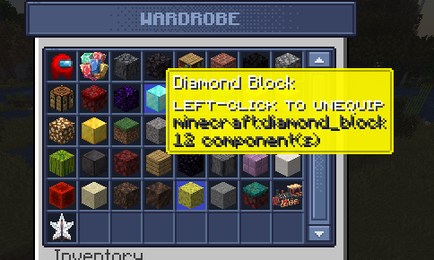

# Creating a model

To create a model you can use BlockBench.


This requires knowledge on how to create resourcepacks and how to manage CustomModelData.


### Step 1

<figure><figcaption></figcaption></figure>

### Step 2

Save the model file into your resourcepack

<figure><figcaption></figcaption></figure>

<figure><figcaption></figcaption></figure>

### Step 3


This requires knowledge on how to create resourcepacks and how to manage CustomModelData.


Create the entry inside the `potion.json` file and decide a CustomModelData to be used later in the CosmeticsCore configurations.

```json
{
  "parent": "item/generated",
  "textures": {
    "layer0": "item/potion_overlay",
    "layer1": "item/potion"
  },
  "overrides": [
    ......
    ......
    {
      "predicate": { "custom_model_data": 600001 },
      "model": "cosmetics:hat/chef_hat"
    },
    ......
    ......
```

<figure><figcaption></figcaption></figure>


