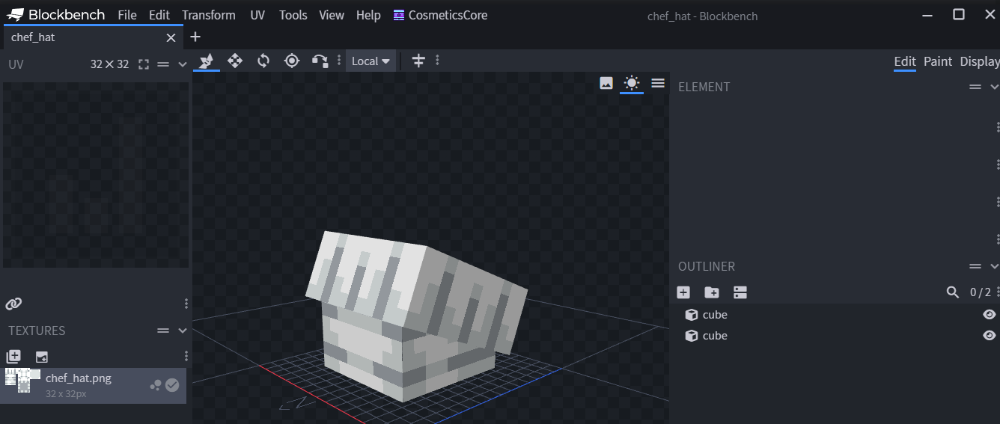
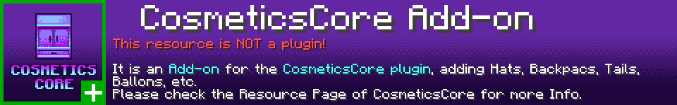

# ™ Branding

## הורד דברים מיתוג

קובץ ה-ZIP להלן מכיל נכסים שתוכל להשתמש בהם עבור דף המשאבים שלך או בנכסים שלך הקשורים ל-CosmeticsCore.\
הקפד לקרוא את [תנאי השימוש](branding.md#usage-terms) לפני שתעשה משהו.



### תצוגה מקדימה של תוכן ה-zip

<figure><figcaption></figcaption></figure>

<figure><figcaption></figcaption></figure>

## תנאי שימוש

אתה **יכול** להשתמש בנכסים...

* בדפי משאבים עבור תוספים ו/או תוספים התומכים ב-CosmeticsCore שבבעלותך.
* בתמונות משלך למשאבים שלך.

...בתנאים הבאים:

* אינך תובע בעלות על הנכסים. הבעלות המקורית נשארת אצל LoneDev, המפתחת של CosmeticsCore.
* אינך טוען שיצרת את הנכסים הללו בעצמך.
* אינך משתמש בנכסים או בחלק מהם ליצירת לוגו המשאב שלך.
* אתה לא מחלק מחדש את הנכסים. זה כולל אך לא מוגבל לגרסאות ששונו הן של קובץ ה-ZIP והן של הקבצים עצמם.
* תן קרדיט לדף המיתוג המקורי (זה) על ידי קישור אליו.
* ניתן להשתמש בתמונות רק לציטוט CosmeticsCore.

## קרדיט

* תודה ל- Andre\_601 על יצירת קובץ הבאנר של הפלאגין.
