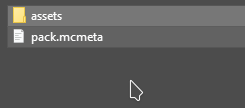

# Install base resourcepack

**CosmeticsCore** uses a resourcepack to work.\
The pack includes also the GUI and various UI interfaces which are mandatory for the plugin to work.

It also offers a set of example cosmetics which you can install if you want them.

## Installation

Open the zip file which can be found here: `plugins/CosmeticsCore/default_assets.zip`

<figure><figcaption></figcaption></figure>

Folders:

* `Resourcepack` -> contains the resourcepack with all the models/textures
* `ItemsAdder_configurations` -> contains the **ItemsAdder** balloons entities configurations
* `CosmeticsCore_configurations` -> contains the **CosmeticsCore** default cosmetics configuration

## Installing the resourcepack <mark style="color:orange;">if you already have a custom resourcepack</mark>


Read [here](install-base-resourcepack.md#installing-the-resource-pack-if-you-dont-have-a-resourcepack) if you don't have a resourcepack.


If you already have a custom resourcepack on your server you must merge the **CosmeticsCore** assets and (optional) default cosmetics.

### Step 1

Copy `assets/z_cosmetics` and `assets/cosmetics` folder into your resourcepack.&#x20;

<figure><figcaption></figcaption></figure>

### Step 2

Open the file `assets/minecraft/models/item/fermented_spider_eye.json` with your favorite editor (example: **VSCode**) and don't close it (the file is inside the zip).

<figure><figcaption></figcaption></figure>

### Step 3

Open the same previous file path in **YOUR** resourcepack (`fermented_spider_eye.json`).

Note: if you don't have this file in your resourcepack skip this step and simply copy and paste the `fermented_spider_eye.json` file inside your resoucepack into this path `assets/minecraft/models/item/fermented_spider_eye.json` .\

Use this tool to merge the **CosmeticsCore** file and your file:




`Json 1` is your json file, `Json 2` is the `CosmeticsCore` json file.

The result json is the one you will have to replace in your pack.


Now copy the result json and paste it into your old json file.

### Step 4

Follow the same previous steps for `potion.json`.

## Installing the resource pack if you <mark style="color:orange;">don't</mark> have a resourcepack

### Step 1

Extract the `Resourcepack` folder from the zip file to any folder of your PC.

### Step 2

Compress the `Resourcepack` folder CONTENTS (do not compress the folder itself).\
Select all the files and compress them.

<figure><figcaption></figcaption></figure>

### Step 3

Now decide a way to host your resourcepack, you usually would use **Dropbox** and `server.properties`. Do some research online on how to host resourcepacks.

## Installing the default cosmetics configuration

Open the zip file which can be found here: `plugins/CosmeticsCore/default_assets.zip` .

Copy the content of `CosmeticsCore_configurations` into your `CosmeticsCore` plugin folder.

Reload the plugin using `/cosmeticsconfig cosmetics reload` .

## Removing the default cosmetics

If you don't need the default cosmetics and you only need the UI you have to delete this folder from your pack: `assets/cosmetics/`


### Important: do not delete `assets/z_cosmetics/`

