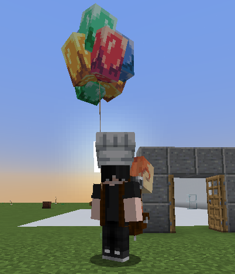

# ItemsAdder

## Installing the resourcepack <mark style="color:orange;">if you use ItemsAdder</mark>


Requires ItemsAdder v3.3 or greater


### Step 1

Open the zip file which can be found here: `plugins/CosmeticsCore/default_assets.zip` .

Extract it to a new folder, on your desktop for example.\
Note: ignore the `resourcepack` folder, you don't need it.

If you don't need the default cosmetics and you only need the UI you have to delete these folders and files:

* `plugins/ItemsAdder/contents/resourcepack/assets/cosmetics/`
* `plugins/ItemsAdder/contents/configs/cosmetics/`
* `plugins/ModelEngine/`
* `plugins/CosmeticsCore/`

### Step 2

Copy the previous `plugins` folder into your server `plugins` folder and replace files if asked.

### Step 3 (if you have ModelEngine)

If you have ModelEngine you can get the example balloon item.

Run `/meg reload`.

Open `plugins/ModelEngine/resource pack` folder and copy the `assets` folder.

Create a new folder and paste the assets folder inside of it: `plugins/ItemsAdder/contents/meg/resourcepack/`

### Step 4

Regenerate your ItemsAdder resourcepack using `/iazip` and follow the ItemsAdder hosting tutorial if needed.

### Step 5

Run `/cosmeticsconfig cosmetics reload`

### Done

<figure><figcaption></figcaption></figure>
